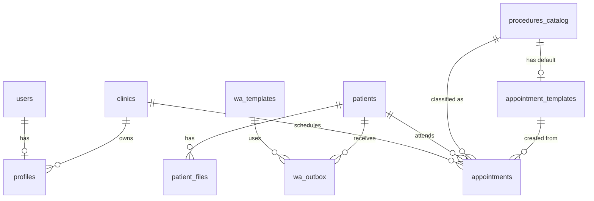

# Smile More Calendar
### Архитектурный документ • версия 2.1 (финальная) • 2025-07-14

Этот документ является единым и финальным источником требований и технических решений для разработки web-приложения учёта пациентов и расписания врача-стоматолога в Израиле с приоритетом на использование на мобильных устройствах (**Mobile-First**).

---

## 0. Участники и роли

| Роль | Пользователь | Права |
|------|--------------|-------|
| **admin** | Настя (врач-предприниматель) | Полный доступ ко всем данным и настройкам. |
| **clinic_staff** | Сотрудник сторонней клиники | Просмотр/добавление записей только своей клиники, без доступа к данным личных пациентов Насти. |
| **assistant** | (зарезервировано) | Будет добавлено в будущем. |

---

## 1. Технологический стек

| Слой | Технологии | Комментарий |
|------|------------|-------------|
| UI | React + Next 15.3.5 (App Router), TypeScript, **Material UI v5**, FullCalendar v6 | **Material UI** выбран в том числе за отличную поддержку адаптивного дизайна и готовые компоненты для мобильных интерфейсов. |
| Client state | React Hook Form + Zod, TanStack Query, Zustand | Современный и производительный стек для управления формами и валидации. |
| PWA | next-pwa + Workbox | Критически важно для Mobile-First. Обеспечивает "нативный" опыт: установка на главный экран, offline-доступ. |
| БД / Auth | Postgres 15 @ Supabase, Auth (Google OAuth) | Основа бэкенда, обеспечивает безопасность данных через RLS. |
| Storage | Supabase Storage с URL-трансформациями | Изображения трансформируются "на лету", что экономит трафик на мобильных устройствах. |
| Интеграции | Edge-functions (Deno) для WhatsApp, cron | Для асинхронной отправки уведомлений и выполнения фоновых задач. |
| WA-provider | Twilio API for WhatsApp | Выбранный провайдер для интеграции. |
| Deploy | Vercel (preview + production), Supabase CLI | Отраслевой стандарт для быстрой и надежной доставки Next.js приложений. |
| Observability | Hotjar, Vercel Analytics, встроенный Supabase Audit Log | Hotjar будет особенно полезен для анализа поведения пользователей на мобильных устройствах (тепловые карты кликов/тапов). |

---

## 2. Компонентная схема

```text
┌──────────────────┐  HTTPS  ┌──────────────────────┐  supabase-js  ┌─────────┐
│ Next 15 PWA      │◄───────►│ Supabase REST / RPC  │◄──────────────►│Postgres │
│ (Mobile-First UI)│         └──────────────────────┘               │  RLS    │
└──┬───────────────┘                ▲ ▲                              └──┬─────┘
   │ Service Worker                Edge Functions                     │
   │                               │ └─wa-notify (Twilio)             │
   │                               └─pg-cron-trigger                  │
   ▼                                                                  ▼
 Hotjar                                                         Supabase Storage
                                                                (с URL-трансформациями)
```

---

## 3. Модель данных (ERD)

*Схема данных не меняется, так как требование Mobile-First влияет на представление, а не на структуру данных.*



### 3.1 Таблицы (ключевые поля)

| Таблица | Ключевые поля |
|---------|---------------|
| **clinics** | `id PK`, `name`, `color_hex` |
| **profiles** | `user_id PK ← users.id`, `role text`, `clinic_id FK?` |
| **procedures_catalog** | `id PK`, `name`, `color_hex`, `created_by FK` |
| **appointment_templates** | `id PK`, `name`, `default_duration_min int`, `default_procedure_id FK?`, `default_cost numeric(10,2)?`, `created_by FK` |
| **patients** | `id PK`, `first_name`, `last_name`, `phone`, `age int`, `notes text`, `medical_info jsonb`, `is_dispensary boolean`, `owner_id FK (admin) NULL`, `created_at` |
| **patient_files** | `id PK`, `patient_id FK`, `file_url`, `mime`, `size`, `uploaded_by FK`, `created_at` |
| **appointments** | `id PK`, `clinic_id FK`, `start_ts`, `end_ts`, `patient_id FK NULL`, `short_label text`, `status enum(scheduled, completed, canceled)`, `procedure_id FK NULL`, `cost numeric(10,2)`, `tooth_num varchar(10)`, `description text`, `private boolean default true`, `created_by FK`, `updated_by FK`, `canceled_by FK?`, `created_at`, `updated_at` |
| **wa_templates** | `id PK`, `code text UNIQUE`, `body_ru text`, `body_il text`, `created_at` |
| **wa_outbox** | `id PK`, `appointment_id FK?`, `patient_id FK`, `template_code text`, `payload jsonb`, `sent_at timestamptz`, `status enum(pending, sent, failed)`, `error_message text` |

---

## 4. RLS-политики и Функции БД

*Политики и функции остаются без изменений, так как они не зависят от устройства клиента.*

### 4.1 Вспомогательные функции

*Функции были обновлены для повышения безопасности путем установки `SECURITY DEFINER` и пустого `search_path`.*

```sql
CREATE OR REPLACE FUNCTION public.current_role() 
RETURNS text
LANGUAGE sql 
STABLE 
SECURITY DEFINER 
SET search_path = ''
AS $$
  SELECT role FROM public.profiles WHERE user_id = auth.uid()
$$;

CREATE OR REPLACE FUNCTION public.current_clinic() 
RETURNS uuid
LANGUAGE sql 
STABLE 
SECURITY DEFINER 
SET search_path = ''
AS $$
  SELECT clinic_id FROM public.profiles WHERE user_id = auth.uid()
$$;
```

### 4.2 Политики безопасности (RLS)

*Политики были обновлены для большей явности и безопасности. Вместо вызова вспомогательных функций используется прямой подзапрос к таблице `profiles`.*

```sql
-- profiles -----------------------------------------------------------
alter table public.profiles enable row level security;
create policy "Users can read own profile" on public.profiles for select using ( user_id = auth.uid() );
create policy "Users can insert own profile" on public.profiles for insert with check ( user_id = auth.uid() );
create policy "Users can update own profile" on public.profiles for update using ( user_id = auth.uid() );

-- clinics ------------------------------------------------------------
alter table public.clinics enable row level security;
create policy "Allow admin full access" on public.clinics for all using ( 
  exists(select 1 from public.profiles where user_id = auth.uid() and role = 'admin') 
);
create policy "Allow staff to read their own clinic" on public.clinics for select using ( 
  exists(select 1 from public.profiles where user_id = auth.uid() and clinic_id = clinics.id) 
);

-- patients -----------------------------------------------------------
alter table public.patients enable row level security;
create policy "Allow admin full access" on public.patients for all using ( 
  exists(select 1 from public.profiles where user_id = auth.uid() and role = 'admin') 
);
create policy "Allow staff to read/create patients for their clinic" on public.patients for select, insert with check ( 
  exists(select 1 from public.profiles where user_id = auth.uid() and role = 'clinic_staff') and owner_id is null 
);

-- appointments -------------------------------------------------------
alter table public.appointments enable row level security;
create policy "Allow admin full access" on public.appointments for all using ( 
  exists(select 1 from public.profiles where user_id = auth.uid() and role = 'admin') 
);
create policy "Allow staff to read appointments of their clinic" on public.appointments for select using ( 
  exists(select 1 from public.profiles where user_id = auth.uid() and role = 'clinic_staff' and clinic_id = appointments.clinic_id) 
);
create policy "Allow staff to insert appointments for their clinic" on public.appointments for insert with check ( 
  exists(select 1 from public.profiles where user_id = auth.uid() and role = 'clinic_staff' and clinic_id = appointments.clinic_id) 
  and private = false and patient_id is null 
);
create policy "Allow staff to update status to canceled" on public.appointments for update using ( 
  exists(select 1 from public.profiles where user_id = auth.uid() and role = 'clinic_staff' and clinic_id = appointments.clinic_id) 
) with check ( status = 'canceled' );
```

### 4.3 Триггер для проверки пересечений

*Функция триггера была обновлена для повышения безопасности путем установки пустого `search_path`.*

```sql
CREATE OR REPLACE FUNCTION public.check_appointment_overlap()
RETURNS TRIGGER 
LANGUAGE plpgsql
SET search_path = ''
AS $$
BEGIN
  IF EXISTS (
    SELECT 1 FROM public.appointments
    WHERE
      (clinic_id = NEW.clinic_id OR (clinic_id IS NULL AND NEW.clinic_id IS NULL)) AND
      id != COALESCE(NEW.id, '00000000-0000-0000-0000-000000000000') AND
      tstzrange(start_ts, end_ts, '[]') && tstzrange(NEW.start_ts, NEW.end_ts, '[]') AND
      status != 'canceled'
  ) THEN
    RAISE EXCEPTION 'timeslot_is_already_booked'
      USING HINT = 'Выбранный временной слот уже занят.';
  END IF;
  RETURN NEW;
END;
$$;

CREATE TRIGGER trigger_check_appointment_overlap
BEFORE INSERT OR UPDATE ON public.appointments
FOR EACH ROW EXECUTE FUNCTION check_appointment_overlap();
```

---

## 5. Сценарии использования

*Сценарии остаются прежними, но их реализация в UI будет адаптирована для мобильных экранов.*

| № | Сценарий | Участники | Поток |
|---|----------|-----------|-------|
| 1 | **Создание приёма (Настя)** | admin | Выбирает слот в календаре → (опционально) выбирает **шаблон приёма** → поля заполняются → `insert appointments` → триггер пишет в `wa_outbox`. |
| 2 | **Запись сотрудником клиники** | clinic_staff | В календаре своей клиники выбирает слот → `insert appointments` (private=false, patient_id=NULL, short_label). |
| 3 | **Завершение приёма** | admin | Заполняет `tooth_num`, `procedure_id`, `description`, `cost` → `update status = completed`. |
| 4 | **Отмена** | admin / staff | `update status = canceled`; триггер → WA «Отменено». |
| 5 | **Напоминания –1 день** | системный cron | `pg_cron` ежедневно в 10:00 вызывает edge-функцию, которая формирует сообщения в `wa_outbox`. |
| 6 | **Ручное уведомление** | admin | Кнопка «Напомнить о приёме» в карточке пациента → выбор шаблона/текст → запись в `wa_outbox`. |
| 7 | **Загрузка файлов** | admin | UI получает pre-signed URL от Supabase → PUT-запрос загружает файл → запись в `patient_files`. |
| 8 | **Экспорт в Excel** | admin | Запрос REST RPC `export_appointments(period)` → возвращается `.xlsx` файл (функция может быть скрыта на мобильных устройствах и доступна только на десктопе). |
| 9 | **Управление шаблонами** | admin | В специальном разделе UI создаёт/редактирует `appointment_templates` и `wa_templates`. |

---

## 6. Интеграция WhatsApp

- **Провайдер:** **Twilio API for WhatsApp**.
- **Механизм:** Асинхронная очередь на базе таблицы `wa_outbox`.
- **Процесс:**
  1. Действия в приложении или cron-задача создают записи в `wa_outbox` со статусом `pending`.
  2. Edge-функция `wa-notify` запускается по расписанию.
  3. Функция забирает пачку записей со статусом `pending`, вызывает API Twilio.
  4. Обновляет статус в `wa_outbox` на `sent` или `failed`.

---

## 7. Хранилище файлов

- **Бакет:** `patient-files`. Политика доступа через RLS.
- **Процесс:** Файлы загружаются в оригинальном размере. Для отображения используются **URL-трансформации** Supabase Storage для оптимизации под мобильные экраны.

---

## 8. PWA / UX (Mobile-First)

- **Основной принцип:** **Проектирование интерфейса начинается с мобильного экрана.** Все элементы должны быть легко доступны и читаемы на смартфонах. Десктопная версия является расширением мобильной.
- **Стартовый экран:** После входа пользователь попадает на экран **календаря в режиме "Неделя" (`week view`)**.
- **Навигация по календарю:** Пользователю доступны легкодоступные переключатели для смены вида: **"День" (`day view`)**, **"Неделя" (`week view`)**, **"Месяц" (`month view`)**.
- **Компоненты:** Использование компонентов Material UI, оптимизированных для touch-интерфейсов (например, `Drawer` для навигации, `Dialog` вместо модальных окон, `Floating Action Button` для быстрых действий).
- **Offline:** Кэширование статики для быстрой загрузки и базовой работы без сети.
- **Визуализация:**
  - Цвет события в календаре: фон = цвет клиники, тонкая левая полоса = цвет процедуры.
  - Интерактивность: Drag-and-drop и resize событий должны быть протестированы на touch-устройствах.
- **Ролевой UX:**
  - **`clinic_staff`:** Видит только календарь своей клиники.
  - **`admin`:** Видит объединенный календарь с фильтрацией.

---

## 9. Нефункциональные требования

| Требование | Значение |
|------------|----------|
| **Основное устройство** | **Мобильный телефон (iOS/Android)** |
| Одновременных пользователей | ≤ 5 |
| JWT lifetime | ≤ 7 суток |
| Логи аудита | Используется встроенный Supabase Audit Log. |
| Back-up | Supabase daily, retention 7 days |
| TTFB (prod) | < 200 мс из Израиля (особенно важно для мобильных сетей) |
| Overlap check | Эксклюзивная проверка через триггер БД. |

---

## 10. CI / CD и начальная настройка

1.  **CI/CD:** GitHub → Vercel Preview (per PR) → Vercel Production (on merge). Миграции и функции деплоятся через `supabase-cli`.
2.  **Начальное наполнение (Seeding):** Создать файл `supabase/seed.sql` для автоматического наполнения таблиц `clinics`, `procedures_catalog`, `wa_templates`. Пример наполнения:
    ```sql
    -- supabase/seed.sql
    INSERT INTO public.clinics (name, color_hex) VALUES
    ('Smile More Clinic', '#3498db'),
    ('Dudko Dental Clinic', '#e74c3c');

    INSERT INTO public.procedures_catalog (name, color_hex) VALUES
    ('Консультация', '#f1c40f'),
    ('Гигиена', '#1abc9c');
    
    -- ... и так далее для других таблиц
    ```

---

## 11. Road-map

### MVP
- [ ] **Auth & Roles:** Настройка аутентификации через Google, создание ролей `admin` и `clinic_staff`, полная реализация RLS-политик.
- [ ] **CRUD-интерфейсы (Mobile-First):**
    - [ ] Управление клиниками (`clinics`).
    - [ ] Управление каталогом процедур (`procedures_catalog`).
    - [ ] Управление пациентами (`patients`).
    - [ ] Управление шаблонами приёмов (`appointment_templates`).
    - [ ] **Управление шаблонами сообщений WhatsApp (`wa_templates`) с UI-редактором (RU/IL).**
- [ ] **Основной функционал (Mobile-First):**
    - [ ] Календарь (day/week/month) с **недельным видом по умолчанию**.
    - [ ] Реализация триггера для проверки пересечений приёмов.
    - [ ] **Полная реализация автоматизации WhatsApp с Twilio** (сценарии 1, 4, 5, 6).
    - [ ] Загрузка/просмотр файлов пациентов с использованием URL-трансформаций.
    - [ ] Экспорт расписания в Excel (может быть доступен только в десктопной версии).
- [ ] **PWA & Deploy:** Настройка PWA, деплой на Vercel, интеграция Hotjar.

### Post-MVP (v1.1 и далее)
- [ ] **Аналитика:** UI для просмотра встроенного лога аудита Supabase, дашборды с аналитикой.
- [ ] **Расширение функционала:**
    - [ ] Внедрение роли `assistant`.
    - [ ] Offline-кэширование данных (через IndexedDB) для полноценной работы без сети.
- [ ] **Безопасность:** Усиление безопасности (например, WebAuthn).
